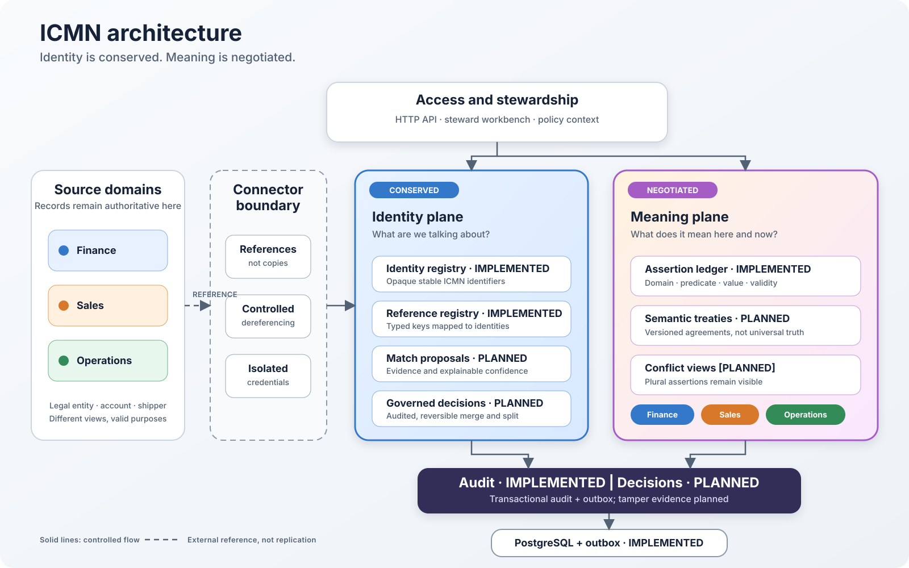

# ICMN

**Identity Conserved. Meaning Negotiated.**

ICMN is an open-source, identity-centric master data platform. It establishes durable enterprise identities while allowing each domain to maintain its own contextual assertions and terminology.

The project intentionally separates three things that conventional MDM often collapses:

- **Identity** — the stable referent shared across systems.
- **References** — links to representations held in source systems; source data need not be copied into ICMN.
- **Meaning** — versioned, attributable assertions made by domains about an identity.



## Status

This repository is at the architectural seed stage. The initial Go service is deliberately small but executable. It demonstrates the core model and gives contributors and coding agents a tested foundation rather than a speculative framework.

## Quick start

Requires Go 1.27 or newer.

```bash
go test ./...
go run ./cmd/icmn
```

The server listens on `:8080` by default. Set `ICMN_ADDR` to override it.

```bash
curl -s -X POST http://localhost:8080/v1/entities \
  -H 'Content-Type: application/json' \
  -d '{"kind":"organization"}'
```

The response contains the conserved ICMN identity. Domain assertions and external references can then be attached without turning either into the identity itself.

## Repository map

```text
cmd/icmn/            service entry point
internal/identity/   domain model and identity operations
internal/httpapi/    HTTP transport
docs/                architecture, principles, and roadmap
paper/               source of the accompanying paper
.github/             CI and contribution automation
```

Start with [AGENTS.md](AGENTS.md) when using Codex, [docs/architecture.md](docs/architecture.md) when making design decisions, and [docs/threat-model.md](docs/threat-model.md) before changing a trust boundary or security-sensitive workflow.

## Scope of the first usable release

- durable identities and aliases
- externally held source records represented by typed references
- domain-owned, temporal assertions
- provenance and an append-only change history
- deterministic matching proposals, never silent merges
- API-first operation with pluggable persistence

See [docs/roadmap.md](docs/roadmap.md) for staged delivery and explicit non-goals.

## Principles

1. An identity is not a golden record.
2. Source systems remain authoritative for their representations.
3. Assertions always have a domain, provenance, and time.
4. Conflicting assertions may coexist.
5. Automated matching proposes; governed decisions merge or split.
6. Every consequential change must be explainable and reversible.

## Paper

The conceptual argument lives in [`paper/icmn.tex`](paper/icmn.tex). Build it with:

```bash
make paper
```

## Contributing and security

Contributions are welcome; see [CONTRIBUTING.md](CONTRIBUTING.md). Please report vulnerabilities according to [SECURITY.md](SECURITY.md).

## License

ICMN is licensed under the [MIT License](LICENSE).
