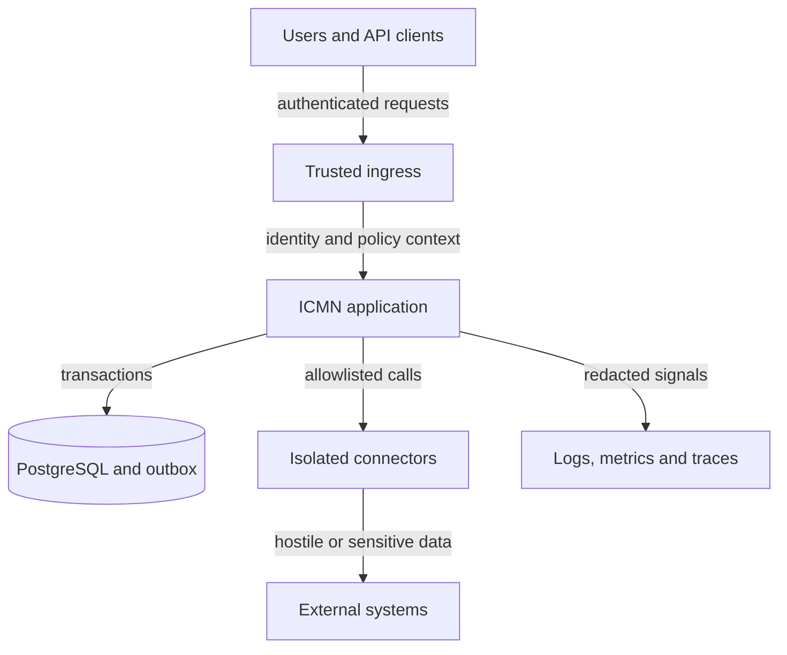

# ICMN threat assessment

Status: initial design assessment for v0.1.0  
Last reviewed: 2026-09-09  
Owner: project maintainers

## Executive assessment

ICMN is security-sensitive even when source records remain elsewhere. A cross-system identity graph reveals that records belong to the same real-world subject; its links, decisions, and provenance are themselves potentially personal or commercially sensitive data.

The dominant risks are:

1. **False identity convergence** through poisoned evidence or abused stewardship.
2. **Unauthorized identity decisions**, especially malicious or mistaken merges and splits.
3. **Cross-boundary disclosure** that correlates domains or tenants beyond authorization.
4. **Semantic laundering** that presents one domain's assertion as global truth.
5. **Connector abuse** leading to SSRF, credential theft, or data exfiltration.
6. **History corruption** that makes provenance and decisions impossible to reconstruct.

Until the controls marked as release gates are implemented and tested, ICMN is suitable only for local evaluation with fictional data.

## Method and scoring

This assessment combines asset and trust-boundary analysis with STRIDE and ICMN-specific abuse cases. Risk is qualitative:

- **Critical** — may systematically corrupt identity, cross isolation boundaries, or undermine the decision ledger.
- **High** — may disclose or materially alter sensitive identity or semantic data.
- **Medium** — meaningful but constrained impact, or a prerequisite for a larger attack.
- **Low** — limited impact with straightforward recovery.

Ratings are inherent risk before planned controls. Reassess residual risk whenever architecture or controls change.

## Scope and assumptions

In scope are the Go service, steward UI, PostgreSQL/outbox, identity provider integration, connectors, external source interaction, telemetry, backups, build and release paths, and compromised or malicious users and systems.

The initial assumptions are:

- v0.1.0 is self-hosted and single-tenant unless isolation is explicitly completed;
- TLS terminates at a trusted ingress in deployments;
- identity providers and source systems are separately operated but may return hostile input;
- local unauthenticated development binds to loopback and uses fictional data only;
- storing a URI never grants permission to fetch it.

## Assets and security objectives

| Asset | Confidentiality | Integrity | Availability |
|---|---|---|---|
| Identity graph and aliases | High: links reveal relationships | Critical: bad links corrupt downstream interpretation | High |
| External references | High: keys identify systems/subjects | Critical: reassignment changes the referent | High |
| Assertions and schemas | Domain-dependent | High: domain, value, and time must remain attributable | Medium |
| Match evidence and proposals | High | Critical: manipulation can cause false convergence | Medium |
| Merge/split decisions | High | Critical: must be authorized and reversible | High |
| Provenance and audit ledger | High | Critical: tampering must be detectable | High |
| Connector credentials | Critical | Critical | High |
| Authorization policy | High | Critical | High |
| Backups, exports, telemetry | High | High | High |

## Actors

- unauthenticated attacker;
- domain contributor;
- identity steward;
- tenant/domain administrator;
- platform or database operator;
- compromised API client, connector, source, or identity provider;
- malicious or careless insider;
- dependency/build supply-chain attacker.

No actor is trusted solely because of network location. Stewardship and administrative privileges are not assumed benign.

## Trust boundaries

Authentication is not authorization. The database must not be able to silently rewrite history. References are identifiers, not permission to fetch. Connector responses are hostile. Telemetry and exports are separate disclosure boundaries.

## Threat register

| ID | Threat and abuse case | STRIDE | Risk | Required controls | Verification |
|---|---|---|---|---|---|
| TM-01 | Poisoned identifiers/evidence cause different subjects to be proposed or merged. | T | Critical | Provenance; versioned normalization; proposal-only automation; negative evidence; explained confidence; steward approval; safe split. | Adversarial corpus; false-merge tests; merge/split round trip. |
| TM-02 | A compromised steward, replay, or confused deputy performs an unauthorized merge/split. | S/T/E | Critical | Deny-by-default action policy; separation of duties; step-up for decisions; idempotency; CSRF defense; immutable actor/reason. | Authorization matrix; replay and CSRF tests. |
| TM-03 | Data crosses tenant, domain, predicate, or source-system boundaries. | I/E | Critical | No tenancy claim before isolation; tenant-scoped storage/queries; centralized policy on every request; database enforcement where useful. | Negative isolation tests for every route/job/cache/export. |
| TM-04 | A typed reference is raced, duplicated, ambiguously normalized, or reassigned. | T | Critical | Transactional uniqueness; explicit lifecycle; canonical tuple; optimistic concurrency; idempotent commands. | Concurrent writes and normalization collision corpus. |
| TM-05 | Assertions are forged, backdated, overwritten, or attributed to the wrong domain. | T/R | High | Append-only revisions; domain authorization; server-recorded time; validity separate from recording time; authenticated producer. | Tamper, time, and provenance reconstruction tests. |
| TM-06 | UI/API aggregation promotes one domain claim as universal truth or hides disagreement. | T/I | High | Domain always visible; no implicit winner; explicit conflicts; purpose-bound projections; provenance in UI/API. | Contradictory-assertion API/UI scenarios. |
| TM-07 | Proposal, decision, or audit history is changed or removed. | T/R | Critical | Append-only events; restricted writer; monotonic sequence; external digest checkpoints; immutable backup; recorded redactions. | Tamper detection, restore, and reconciliation exercise. |
| TM-08 | A reference URI makes a connector access metadata services, loopback, private networks, files, or malicious redirects. | S/I/E | Critical | Never fetch on display; connector capabilities; scheme/host/port allowlists; validate every DNS/redirect hop; block private ranges; egress firewall; strict limits. | SSRF tests covering redirects, rebinding, IPv6, encodings, and schemes. |
| TM-09 | Connector credentials leak into records, errors, logs, traces, URLs, or source control. | I | Critical | External secret store; short-lived least-privilege tokens; no secrets in domain objects/URLs; central redaction; rotation. | Secret scanning; telemetry tests; rotation exercise. |
| TM-10 | A connector/source discloses more fields than the caller may access. | I/E | High | Propagate purpose/policy context; per-connector identity; minimization; response filtering; isolation; no shared super-token. | Connector contract and least-privilege tests. |
| TM-11 | Search/export/enumeration reconstructs the identity graph at scale. | I | Critical | Object/field authorization; purpose limits; rate limits; export approval; audited exports; anomaly detection. | Bulk enumeration and export abuse tests. |
| TM-12 | IDs, errors, or timing reveal whether an identity/source key exists. | I | Medium | Opaque random IDs; authorized search; disclosure-safe errors; rate limits; minimal identifiers in logs. | Enumeration and timing tests. |
| TM-13 | Large JSON, expensive matching/search, connector delay, or event backlog exhausts resources. | D | High | Size/depth limits; bounded queries; pagination; quotas; timeouts/cancellation; concurrency limits; backpressure. | Load, fuzz, cancellation, and degraded-source tests. |
| TM-14 | Hostile source/assertion content executes in a browser or forges a steward action. | S/T/E | High | Contextual encoding; strict CSP; no raw source HTML; secure cookies; CSRF protection; no state changes by GET; decision reauthorization. | XSS corpus, CSP/security-header and CSRF tests. |
| TM-15 | Commands or outbox events are replayed, reordered, forged, or processed twice. | T/R/D | High | Transactional outbox; immutable event ID/version; idempotent consumers; ordering; authenticated transport; quarantine. | Duplicate/reorder/restart tests and reconciliation. |
| TM-16 | A dependency, action, migration, or container compromises a release. | T/E | High | Minimize dependencies; immutable action pins before release; review/scanning; SBOM; reproducible signed builds/images. | CI supply-chain checks and clean rebuild comparison. |
| TM-17 | Backups expose graph data or restore stale policy, missing links, or incomplete history. | I/T/D | High | Encrypted restricted backups; integrity manifest; point-in-time recovery; isolated restore; separate secrets. | Scheduled restore and invariant reconciliation. |
| TM-18 | Privacy deletion silently mutates history, or retained links enable re-identification. | I/T/R | High | Classification/minimization; purpose/retention rules; explicit tombstone/redaction events; unlink workflow; privacy impact assessment. | Data-subject workflow and residual-link review. |

### Implemented controls

- **TM-13 (partial):** every current JSON command endpoint rejects request bodies
  larger than 1 MiB and requires exactly one complete JSON value, with only
  trailing whitespace permitted inside that limit. Black-box tests cover every
  registered POST endpoint and verify that rejected bodies do not reach a store
  mutation. Depth limits, quotas, timeouts, concurrency controls, and broader load
  and fuzz verification remain release-gate work, so the inherent High rating is
  unchanged.

## Security invariants

- Matching creates proposals only; it never creates merge decisions.
- Every merge/split is authenticated, authorized, idempotent, attributable, and reversible.
- Old ICMN identifiers resolve after merge without bypassing caller authorization.
- Authorization is evaluated for the action and object on every request.
- An assertion gains no authority by being copied, aggregated, or displayed by ICMN.
- Rendering a reference never triggers a network request.
- Keys, URIs, values, evidence, and source responses are untrusted input.
- Corrections add audit events; they do not rewrite prior events.
- Telemetry excludes values, source payloads, credentials, and raw evidence by default.
- Multi-tenancy is unsupported until every boundary is negatively isolation-tested.

## Release gates

### Before shared or network-accessible deployment

- authentication with no development bypass;
- centralized deny-by-default authorization;
- TLS and secure session/token handling;
- input, rate, timeout, and concurrency controls;
- telemetry redaction tests;
- encrypted backups and successful restore drill;
- dependency, secret, static, and container scanning;
- incident contact and credential-rotation procedure.

### Before merge/split

- approved decision-event ADR;
- explicit steward permission and separation-of-duties decision;
- idempotency and optimistic concurrency;
- append-only audit with tamper-evident checkpoints;
- tested split preserving references, assertions, aliases, and history;
- alerts for unusual decision volume and reversals.

### Before connectors

- isolated connector identity;
- destination allowlist plus network egress enforcement;
- redirect, rebinding, private-range, scheme, timeout, and size defenses;
- external secret storage and tested rotation;
- response minimization and connector-specific threat review.

### Before claiming multi-tenancy

- tenant-aware schema and policy;
- explicitly documented uniqueness scope;
- negative isolation tests for API, storage, search, export, audit, caches, jobs, and backups;
- tenant-aware operational and incident procedures.

## Verification programme

- table-driven tests from an actor/resource/action authorization matrix;
- property tests for identity/reference invariants and merge/split reversibility;
- Go fuzzing for JSON, identifiers, normalization, and assertion values;
- race/concurrency tests for reference assignment and decisions;
- adversarial matching corpora measuring false positives;
- isolated-network SSRF integration tests;
- browser tests for XSS, CSRF, CSP, cookies, and headers;
- migration, backup, restore, and audit reconciliation tests;
- dependency, secret, SAST, container, and SBOM checks in CI;
- manual abuse-case review at every milestone.

## Detection, containment, and recovery

Security events should include actor/service identity, tenant/domain context, action, opaque target ID, outcome, policy-decision ID, correlation ID, and server time—without sensitive payload values.

Alert on bulk enumeration/export, abnormal merge/split or reversal volume, one actor approving its own proposals, conflict/collision spikes, blocked connector destinations, authorization bypass patterns, audit/outbox gaps, reconciliation failures, and anomalous credential use.

Containment must support disabling a connector, revoking an actor, pausing decisions, and placing identities into review without deleting evidence. Recovery from identity corruption should replay the decision ledger, split false convergence, restore reference ownership, and notify known downstream consumers.

## Residual and philosophical risks

Even correct identity convergence increases linkability across domains. Reversibility limits damage but cannot retract information already disclosed downstream. Human stewardship improves explainability while introducing insider and coercion risk. Technical controls therefore require purpose limitation, organizational governance, and independent review.

“Meaning is negotiated” must not excuse deceptive or unlawful assertions. ICMN preserves plurality and provenance; domain owners remain accountable for what they assert and how it is used.

## Maintenance

Update this assessment whenever a trust boundary, actor, data class, connector capability, authorization model, tenancy claim, matching algorithm, or deployment architecture changes. Every material pull request must state whether it adds a threat, changes a rating, or implements a listed control.

## References

- [NIST SP 800-207: Zero Trust Architecture](https://csrc.nist.gov/pubs/sp/800/207/final)
- [OWASP Authorization Cheat Sheet](https://cheatsheetseries.owasp.org/cheatsheets/Authorization_Cheat_Sheet.html)
- [OWASP SSRF Prevention Cheat Sheet](https://cheatsheetseries.owasp.org/cheatsheets/Server_Side_Request_Forgery_Prevention_Cheat_Sheet.html)
- [OWASP CSRF Prevention Cheat Sheet](https://cheatsheetseries.owasp.org/cheatsheets/Cross-Site_Request_Forgery_Prevention_Cheat_Sheet.html)
